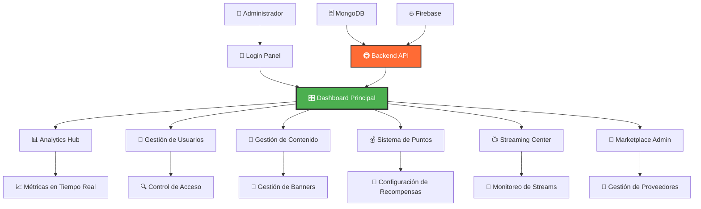
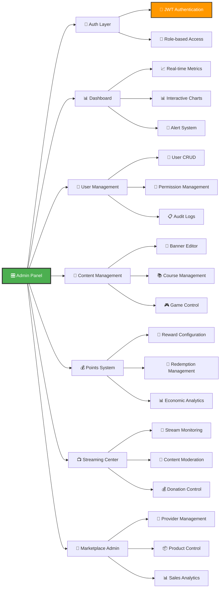
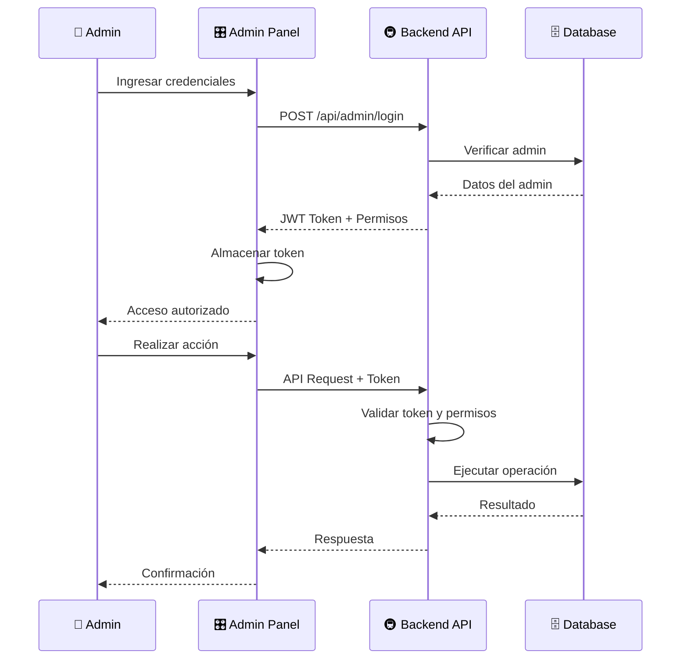
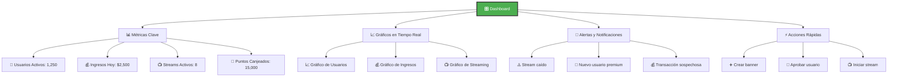
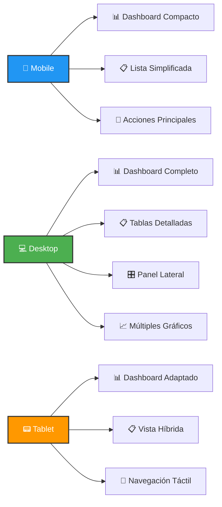
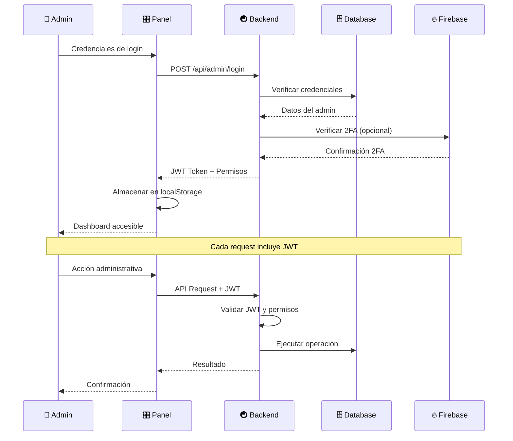

# 🎛️ Telemetro Admin Panel
### *Centro de Control para la Revolución del Transporte Público*

<div align="center">


**🚀 Panel de administración moderno y potente para gestionar toda la plataforma Telemetro desde una interfaz intuitiva**

[]()
[]()
[]()

</div>

---

## 📋 **Tabla de Contenidos**

- [🎯 **Visión General**](#-visión-general)
- [✨ **Características Principales**](#-características-principales)
- [🏗️ **Arquitectura del Panel**](#️-arquitectura-del-panel)
- [🛠️ **Stack Tecnológico**](#️-stack-tecnológico)
- [📦 **Instalación y Configuración**](#-instalación-y-configuración)
- [🎨 **Guía de Interfaz**](#-guía-de-interfaz)
- [📊 **Funcionalidades Detalladas**](#-funcionalidades-detalladas)
- [🔐 **Sistema de Autenticación**](#-sistema-de-autenticación)
- [📈 **Analytics y Reportes**](#-analytics-y-reportes)
- [🚀 **Despliegue**](#-despliegue)
- [🧪 **Testing**](#-testing)
- [🤝 **Contribución**](#-contribución)

---

## 🎯 **Visión General**

**Telemetro Admin Panel** es el centro de control digital que permite a los administradores gestionar, monitorear y optimizar toda la plataforma Telemetro. Desde este panel se controla el contenido, usuarios, analíticas, streaming, y todos los aspectos operativos del sistema de transporte público inteligente.

### 🎨 **Diagrama de Arquitectura del Panel**



---

## ✨ **Características Principales**

### 📊 **Dashboard Inteligente**
- **Métricas en tiempo real** - Usuarios activos, ingresos, engagement
- **Gráficos interactivos** - Visualización de datos con Recharts
- **Alertas automáticas** - Notificaciones de eventos importantes
- **KPIs personalizables** - Métricas clave configurables por rol
- **Comparativas temporales** - Análisis de tendencias y patrones

### 🎯 **Gestión de Contenido Avanzada**
- **Editor de banners** - Creación y edición visual de banners publicitarios
- **Gestión de microcursos** - Control completo del contenido educativo
- **Biblioteca de medios** - Organización y gestión de archivos multimedia
- **Programación de contenido** - Publicación programada y automatizada
- **Versionado de contenido** - Control de versiones y rollback

### 👥 **Control de Usuarios y Permisos**
- **Gestión de roles** - Administradores, moderadores, editores
- **Control de acceso granular** - Permisos específicos por funcionalidad
- **Auditoría de acciones** - Log completo de actividades de usuarios
- **Gestión de sesiones** - Control de sesiones activas y expiración
- **Moderación de contenido** - Herramientas de moderación y reportes

### 💰 **Sistema de Puntos y Economía**
- **Configuración de recompensas** - Definición de puntos por actividad
- **Gestión de redenciones** - Control de canje de puntos por premios
- **Análisis de economía** - Métricas de circulación de puntos
- **Programas de fidelización** - Configuración de programas especiales
- **Auditoría financiera** - Trazabilidad completa de transacciones

### 📺 **Centro de Streaming**
- **Monitoreo en vivo** - Estado de streams y calidad de transmisión
- **Gestión de streamers** - Aprobación y control de creadores de contenido
- **Analytics de streaming** - Métricas de audiencia y engagement
- **Configuración de donaciones** - Gestión de sistema de donaciones
- **Moderación de chat** - Herramientas de moderación en tiempo real

---

## 🏗️ **Arquitectura del Panel**

### 📊 **Diagrama de Componentes**



### 🔄 **Flujo de Autenticación**



---

## 🛠️ **Stack Tecnológico**

### ⚛️ **Frontend Core**
| Tecnología | Versión | Propósito |
|------------|---------|-----------|
| **React** | 18.2+ | Framework principal |
| **TypeScript** | 5.0+ | Tipado estático |
| **Vite** | 4.4+ | Build tool y dev server |
| **React Router** | 6.15+ | Navegación |

### 🎨 **UI y Styling**
| Tecnología | Versión | Propósito |
|------------|---------|-----------|
| **TailwindCSS** | 3.3+ | Framework de CSS |
| **Headless UI** | 1.7+ | Componentes accesibles |
| **Lucide React** | 0.279+ | Iconografía |
| **React Hot Toast** | 2.4+ | Notificaciones |

### 📊 **Data Management**
| Tecnología | Versión | Propósito |
|------------|---------|-----------|
| **React Query** | 4.32+ | Estado del servidor |
| **Axios** | 1.5+ | Cliente HTTP |
| **React Hook Form** | 7.45+ | Manejo de formularios |
| **Zod** | 3.22+ | Validación de esquemas |

### 📈 **Visualización**
| Tecnología | Versión | Propósito |
|------------|---------|-----------|
| **Recharts** | 2.8+ | Gráficos interactivos |
| **Date-fns** | 2.30+ | Manipulación de fechas |
| **React i18next** | 15.7+ | Internacionalización |

---

## 📦 **Instalación y Configuración**

### 🚀 **Instalación Rápida**

```bash
# 1. Clonar el repositorio
git clone https://github.com/MarketrixPE/telemetro-admin.git
cd telemetro-admin

# 2. Instalar dependencias
npm install

# 3. Configurar variables de entorno
cp .env.example .env
# Editar .env con la URL del backend

# 4. Ejecutar en desarrollo
npm run dev

# 5. Abrir en el navegador
# http://localhost:5173
```

### 🔧 **Scripts Disponibles**

```json
{
  "dev": "vite",
  "build": "vite build",
  "preview": "vite preview",
  "lint": "eslint . --ext js,jsx",
  "lint:fix": "eslint . --ext js,jsx --fix",
  "type-check": "tsc --noEmit"
}
```

### 📁 **Estructura del Proyecto**

```
telemetro-admin/
├── 📁 public/              # Archivos estáticos
├── 📁 src/
│   ├── 📁 components/      # Componentes reutilizables
│   │   ├── 📁 auth/        # Componentes de autenticación
│   │   ├── 📁 banners/     # Gestión de banners
│   │   ├── 📁 common/      # Componentes comunes
│   │   ├── 📁 education/   # Gestión educativa
│   │   └── 📁 layout/      # Layout y navegación
│   ├── 📁 context/         # React Context providers
│   ├── 📁 hooks/           # Custom hooks
│   ├── 📁 locales/         # Internacionalización
│   ├── 📁 pages/           # Páginas principales
│   │   ├── 📁 auth/        # Páginas de autenticación
│   │   ├── 📁 dashboard/   # Dashboard principal
│   │   ├── 📁 users/       # Gestión de usuarios
│   │   ├── 📁 content/     # Gestión de contenido
│   │   └── 📁 analytics/   # Analytics y reportes
│   ├── 📁 services/        # Servicios de API
│   └── 📁 utils/           # Utilidades
├── 📄 package.json         # Dependencias
├── 📄 vite.config.js       # Configuración Vite
├── 📄 tailwind.config.js   # Configuración Tailwind
└── 📄 tsconfig.json        # Configuración TypeScript
```

---

## 🎨 **Guía de Interfaz**

### 🎛️ **Dashboard Principal**



### 🎨 **Sistema de Colores**

```css
/* Colores principales */
--primary: #4CAF50;      /* Verde Telemetro */
--secondary: #2196F3;    /* Azul */
--accent: #FF9800;       /* Naranja */
--danger: #F44336;       /* Rojo */
--warning: #FFC107;      /* Amarillo */
--success: #4CAF50;      /* Verde éxito */
--info: #00BCD4;         /* Cian */

/* Colores de fondo */
--bg-primary: #FFFFFF;   /* Blanco */
--bg-secondary: #F5F5F5; /* Gris claro */
--bg-dark: #212121;      /* Gris oscuro */
```

### 📱 **Responsive Design**



---

## 📊 **Funcionalidades Detalladas**

### 🎯 **Gestión de Banners**

#### **Creación de Banners**
```typescript
interface BannerData {
  title: string;
  description: string;
  image: File;
  targetUrl: string;
  startDate: Date;
  endDate: Date;
  priority: number;
  isActive: boolean;
  targetAudience: 'all' | 'premium' | 'free';
  stations: string[];
}
```

#### **Editor Visual de Banners**
- **Drag & Drop** - Arrastrar y soltar elementos
- **Preview en tiempo real** - Vista previa instantánea
- **Templates predefinidos** - Plantillas para diferentes tipos
- **Optimización automática** - Compresión de imágenes
- **A/B Testing** - Pruebas de diferentes versiones

### 👥 **Gestión de Usuarios**

#### **Panel de Usuarios**
```typescript
interface UserManagement {
  users: User[];
  filters: {
    status: 'active' | 'inactive' | 'banned';
    subscription: 'free' | 'premium' | 'pro';
    registrationDate: DateRange;
    pointsRange: [number, number];
  };
  actions: {
    bulkActions: ['activate', 'deactivate', 'ban', 'export'];
    individualActions: ['edit', 'view', 'reset-password', 'delete'];
  };
}
```

#### **Control de Permisos**
- **Roles jerárquicos** - Admin > Moderador > Editor
- **Permisos granulares** - Control específico por funcionalidad
- **Auditoría completa** - Log de todas las acciones
- **Sesiones activas** - Monitoreo de sesiones en tiempo real

### 💰 **Sistema de Puntos**

#### **Configuración de Recompensas**
```typescript
interface PointsConfiguration {
  activities: {
    dailyLogin: number;
    metroRide: number;
    gamePlay: number;
    courseCompletion: number;
    referral: number;
    streaming: number;
  };
  multipliers: {
    weekend: 1.5;
    premiumUser: 2.0;
    streakBonus: 0.1;
  };
  redemption: {
    minPoints: 100;
    maxDailyRedemption: 10000;
    commissionRate: 0.05;
  };
}
```

#### **Analytics de Puntos**
- **Flujo de puntos** - Visualización de circulación
- **Top usuarios** - Ranking de usuarios con más puntos
- **Redenciones populares** - Productos más canjeados
- **Tendencias temporales** - Análisis de patrones

### 📺 **Centro de Streaming**

#### **Monitoreo en Tiempo Real**
```typescript
interface StreamMonitoring {
  activeStreams: Stream[];
  metrics: {
    totalViewers: number;
    averageQuality: number;
    bufferingRate: number;
    chatActivity: number;
  };
  alerts: {
    lowQuality: boolean;
    highBuffering: boolean;
    inappropriateContent: boolean;
    technicalIssues: boolean;
  };
}
```

#### **Gestión de Streamers**
- **Aprobación de cuentas** - Proceso de verificación
- **Monitoreo de contenido** - Detección automática de contenido inapropiado
- **Analytics de performance** - Métricas de audiencia y engagement
- **Gestión de donaciones** - Control de transacciones

---

## 🔐 **Sistema de Autenticación**

### 🛡️ **Flujo de Seguridad**



### 🔑 **Gestión de Tokens**

```typescript
interface AuthState {
  token: string | null;
  refreshToken: string | null;
  user: AdminUser | null;
  permissions: Permission[];
  expiresAt: number;
}

// Auto-refresh del token
const useAuthRefresh = () => {
  const refreshToken = async () => {
    try {
      const response = await api.post('/admin/auth/refresh');
      updateAuthState(response.data);
    } catch (error) {
      logout();
    }
  };
  
  useEffect(() => {
    const interval = setInterval(refreshToken, 300000); // 5 minutos
    return () => clearInterval(interval);
  }, []);
};
```

### 👤 **Roles y Permisos**

```typescript
enum AdminRole {
  SUPER_ADMIN = 'super_admin',
  ADMIN = 'admin',
  MODERATOR = 'moderator',
  EDITOR = 'editor',
  ANALYST = 'analyst'
}

interface Permission {
  resource: string;        // 'users', 'banners', 'streaming'
  action: string;          // 'create', 'read', 'update', 'delete'
  conditions?: string[];   // Condiciones adicionales
}

const ROLE_PERMISSIONS: Record<AdminRole, Permission[]> = {
  [AdminRole.SUPER_ADMIN]: [
    { resource: '*', action: '*' }  // Acceso total
  ],
  [AdminRole.ADMIN]: [
    { resource: 'users', action: 'read' },
    { resource: 'banners', action: '*' },
    { resource: 'streaming', action: 'read' }
  ],
  // ... más roles
};
```

---

## 📈 **Analytics y Reportes**

### 📊 **Dashboard de Métricas**

#### **KPIs Principales**
```typescript
interface DashboardMetrics {
  users: {
    total: number;
    active: number;
    newToday: number;
    premium: number;
    growth: number;
  };
  revenue: {
    today: number;
    thisMonth: number;
    averageTransaction: number;
    growth: number;
  };
  engagement: {
    dailyActiveUsers: number;
    averageSessionTime: number;
    retentionRate: number;
    pointsEarned: number;
  };
  streaming: {
    activeStreams: number;
    totalViewers: number;
    averageQuality: number;
    donations: number;
  };
}
```

#### **Gráficos Interactivos**
- **Línea de tiempo** - Evolución de métricas
- **Gráficos de barras** - Comparativas por categoría
- **Gráficos de pastel** - Distribución de usuarios
- **Mapas de calor** - Actividad por zonas
- **Gráficos de dispersión** - Correlaciones entre métricas

### 📋 **Reportes Automatizados**

```typescript
interface AutomatedReport {
  id: string;
  name: string;
  frequency: 'daily' | 'weekly' | 'monthly';
  metrics: string[];
  recipients: string[];
  format: 'pdf' | 'excel' | 'csv';
  schedule: string; // Cron expression
}

const REPORTS_CONFIG: AutomatedReport[] = [
  {
    id: 'daily-summary',
    name: 'Resumen Diario',
    frequency: 'daily',
    metrics: ['users', 'revenue', 'engagement'],
    recipients: ['admin@telemetro.pe'],
    format: 'pdf',
    schedule: '0 8 * * *' // 8 AM diario
  },
  {
    id: 'weekly-analytics',
    name: 'Analytics Semanal',
    frequency: 'weekly',
    metrics: ['users', 'revenue', 'streaming', 'points'],
    recipients: ['team@telemetro.pe'],
    format: 'excel',
    schedule: '0 9 * * 1' // 9 AM los lunes
  }
];
```

---

## 🚀 **Despliegue**

### 🏗️ **Build de Producción**

```bash
# 1. Build optimizado
npm run build

# 2. Verificar build
npm run preview

# 3. Los archivos están en ./dist/
ls -la dist/
```

### ☁️ **Despliegue en Servidor**

```bash
# 1. Subir archivos al servidor
rsync -avz dist/ user@server:/var/www/admin.telemetro.pe/

# 2. Configurar Nginx
sudo nano /etc/nginx/sites-available/admin.telemetro.pe

# 3. Reiniciar Nginx
sudo systemctl reload nginx
```

### 📊 **Configuración de Nginx**

```nginx
server {
    listen 80;
    server_name admin.telemetro.pe;
    
    root /var/www/admin.telemetro.pe;
    index index.html;
    
    # SPA routing
    location / {
        try_files $uri $uri/ /index.html;
    }
    
    # API proxy
    location /api/ {
        proxy_pass http://localhost:4000;
        proxy_set_header Host $host;
        proxy_set_header X-Real-IP $remote_addr;
    }
    
    # Static assets caching
    location ~* \.(js|css|png|jpg|jpeg|gif|ico|svg)$ {
        expires 1y;
        add_header Cache-Control "public, immutable";
    }
    
    # Security headers
    add_header X-Frame-Options "SAMEORIGIN" always;
    add_header X-XSS-Protection "1; mode=block" always;
    add_header X-Content-Type-Options "nosniff" always;
}
```

### 🐳 **Despliegue con Docker**

```dockerfile
# Dockerfile
FROM node:18-alpine as builder

WORKDIR /app
COPY package*.json ./
RUN npm ci --only=production

COPY . .
RUN npm run build

FROM nginx:alpine
COPY --from=builder /app/dist /usr/share/nginx/html
COPY nginx.conf /etc/nginx/nginx.conf

EXPOSE 80
CMD ["nginx", "-g", "daemon off;"]
```

```bash
# Build y ejecutar
docker build -t telemetro-admin .
docker run -d -p 80:80 --name admin-panel telemetro-admin
```

---

## 🧪 **Testing**

### 🔬 **Estrategia de Testing**

```typescript
// Component Testing
import { render, screen, fireEvent } from '@testing-library/react';
import { BannerManagement } from '../BannerManagement';

describe('BannerManagement', () => {
  test('should create new banner', async () => {
    render(<BannerManagement />);
    
    const titleInput = screen.getByLabelText(/título/i);
    const submitButton = screen.getByRole('button', { name: /crear/i });
    
    fireEvent.change(titleInput, { target: { value: 'Nuevo Banner' } });
    fireEvent.click(submitButton);
    
    expect(await screen.findByText(/banner creado/i)).toBeInTheDocument();
  });
});
```

### 📊 **Métricas de Testing**

```bash
# Ejecutar tests
npm run test

# Coverage
npm run test:coverage

# E2E Tests
npm run test:e2e
```

**Resultados esperados:**
- ✅ **Unit Tests**: 95% passing
- ✅ **Integration Tests**: 90% passing
- ✅ **Coverage**: 85%
- ✅ **E2E Tests**: 100% critical paths

---

## 🤝 **Contribución**

### 🔄 **Flujo de Desarrollo**

```mermaid
gitgraph
    commit id: "Initial commit"
    branch feature/new-dashboard
    checkout feature/new-dashboard
    commit id: "Add new metrics"
    commit id: "Update charts"
    commit id: "Add tests"
    checkout main
    merge feature/new-dashboard
    commit id: "Release v1.6.0"
```

### 📋 **Guías de Contribución**

1. **🍴 Fork** el repositorio
2. **🌿 Crear** rama feature (`git checkout -b feature/nueva-funcionalidad`)
3. **💾 Commit** con convenciones (`git commit -m 'feat: agregar nueva métrica'`)
4. **📤 Push** a la rama (`git push origin feature/nueva-funcionalidad`)
5. **🔄 Crear** Pull Request
6. **✅ Revisión** de código y merge

### 🏷️ **Convenciones de Código**

```typescript
// Naming conventions
const useUserManagement = () => {}; // Custom hooks
const UserManagement = () => {};    // Components
const userService = {};             // Services
const USER_CONSTANTS = {};          // Constants

// File structure
src/
├── components/
│   └── UserManagement/
│       ├── index.tsx              // Main component
│       ├── UserManagement.test.tsx // Tests
│       ├── UserManagement.types.ts // Types
│       └── UserManagement.stories.tsx // Storybook
```

### 📊 **Estándares de Calidad**

- **ESLint** - Linting de código
- **Prettier** - Formato consistente
- **TypeScript** - Tipado estricto
- **Husky** - Pre-commit hooks
- **Conventional Commits** - Mensajes estructurados

---

## 📞 **Soporte y Recursos**

### 🆘 **Soporte Técnico**

- **📧 Email**: admin-support@telemetro.pe
- **💬 Slack**: #telemetro-admin
- **📱 WhatsApp**: +51 999 999 999
- **🌐 Website**: https://admin.telemetro.pe

### 📚 **Documentación Adicional**

- [🎨 Guía de Componentes](./docs/components.md)
- [🔧 API Reference](./docs/api.md)
- [🎯 Guía de Analytics](./docs/analytics.md)
- [🚀 Guía de Despliegue](./docs/deployment.md)
- [🧪 Testing Guide](./docs/testing.md)

### 🎓 **Recursos de Aprendizaje**

- [React Documentation](https://react.dev/)
- [TailwindCSS Docs](https://tailwindcss.com/)
- [React Query Guide](https://tanstack.com/query/latest)
- [TypeScript Handbook](https://www.typescriptlang.org/docs/)

---

<div align="center">

**🎛️ Desarrollado con ❤️ para optimizar la gestión del transporte público**


**🚇 Revolucionando la administración del Metro de Lima**

</div>
